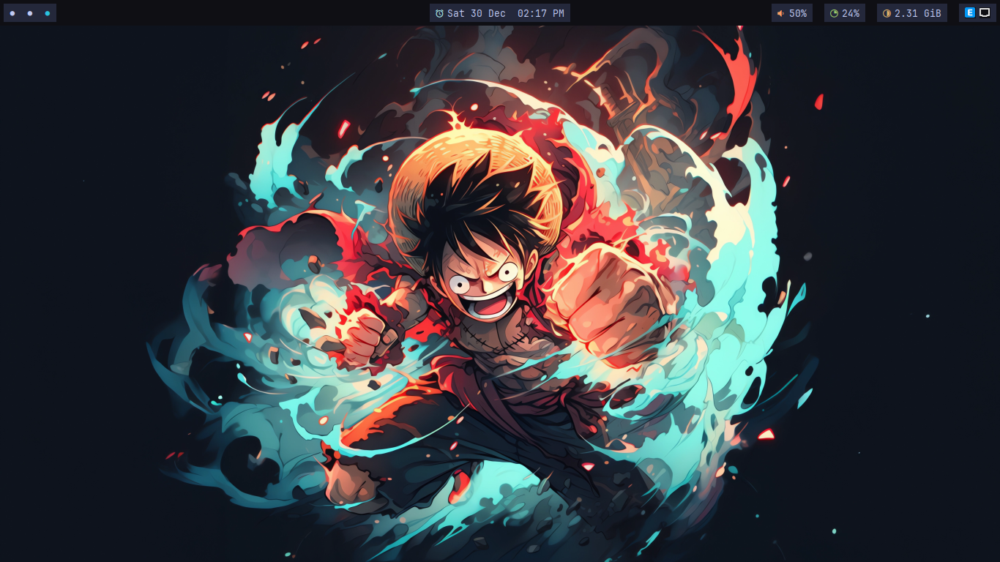
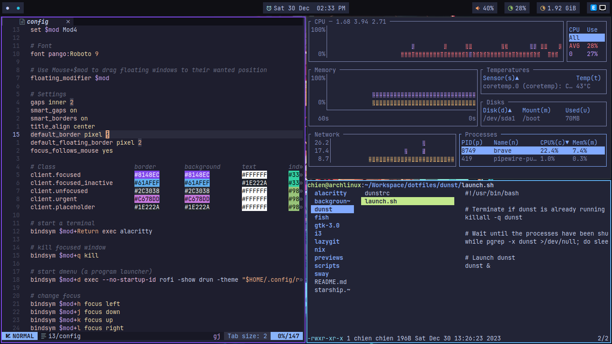
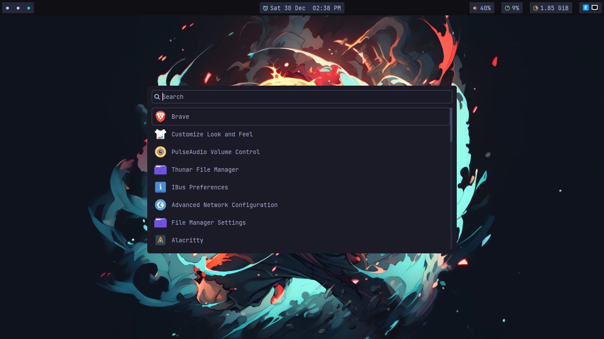

<h1 align="center">2giosangmitom Arch Linux dotfiles</h1>

## i3-wm with Tokyonight colorscheme

### Infomation
- **OS:** Arch Linux
- **WM:** Sway
- **Terminal:** Alacritty
- **Shell:** fish
- **Application Launcher:** wofi
- **File manager:** lf, thunar
- **Status bar:** waybar
- **Notification daemon:** dunst
- **Other tools:** lazygit, neofetch, bottom, ripgrep, starship, fzf, tmux

## sway

### Infomation
- **OS:** Arch Linux
- **WM:** i3
- **Terminal:** Alacritty
- **Shell:** fish
- **Application Launcher:** rofi
- **File manager:** lf, thunar
- **Status bar:** polybar
- **Notification daemon:** dunst
- **Other tools:** lazygit, neofetch, bottom, ripgrep, starship, fzf, tmux
