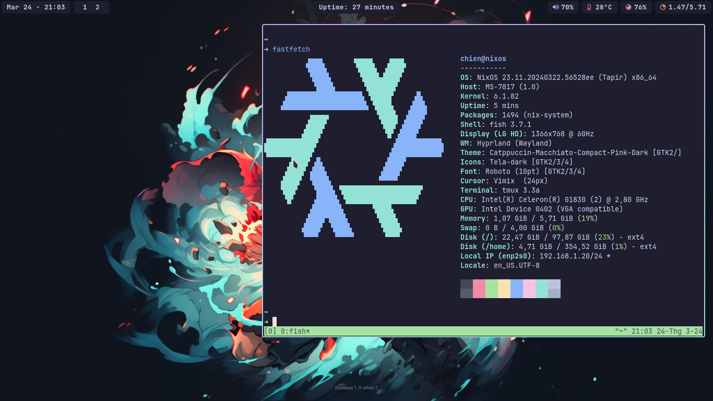

<h1 align="center">❄️ NixOS Configuration ❄️</h1>
<p align="center">A Flake-powered NixOS setup for Developers with Hyprland</p>

<div align="center">
  <a href="https://github.com/2giosangmitom/dotfiles/stargazers">
    
  </a>
  <a href="https://github.com/2giosangmitom/dotfiles/pulse">
    
  </a>
  <a href="https://github.com/2giosangmitom/dotfiles/forks">
    
  </a>
  <a>
    
  </a>
  <a href="https://github.com/2giosangmitom/dotfiles/blob/master/LICENSE">
    
  </a>
</div>

## Introduction

Welcome to my haven of personalized NixOS bliss, featuring the sleek Hyprland window manager and meticulously configured CLI tools! This repository crafts a delightful system experience using the power of flakes and home-manager. With this configuration, you can easily replicate my personalized development environment on any NixOS machine.

## What Awaits You?

- **Flake Repository:** Leverage flakes for a future-proof, modular, and collaborative configuration.
- **Modular Design:** Configuration is organized into modules for easier management and customization.
- **CLI Command Central:** Enjoy a meticulously configured suite of command-line tools for a productive workflow.
  - Pre-configured development tools like Git, tmux, and neovim
- **Home-Manager Integration:** Manage user-specific packages and configurations with ease.
- **Hyprland WM:** Embrace the efficient and aesthetically pleasing Hyprland window manager.

## Getting Started

1. **Take ownership of `/etc/nixos`**

<pre>
chown <b>username</b>:users /etc/nixos
</pre>

> [!NOTE]
> Replace **username** with your username

3. **Clone the repository**

   ```
   git clone https://github.com/2giosangmitom/dotfiles.git /etc/nixos
   ```

## Screenshots

<details>
  <summary>Hyprland</summary>
  
</details>

## Contributing

Contributions are welcome! If you have any suggestions, improvements, or new features to add, feel free to open an issue or pull request.

## Acknowledgements

Special thanks to the NixOS community for their excellent tools and resources, without which this configuration wouldn't be possible.

---

Happy hacking! 🚀
